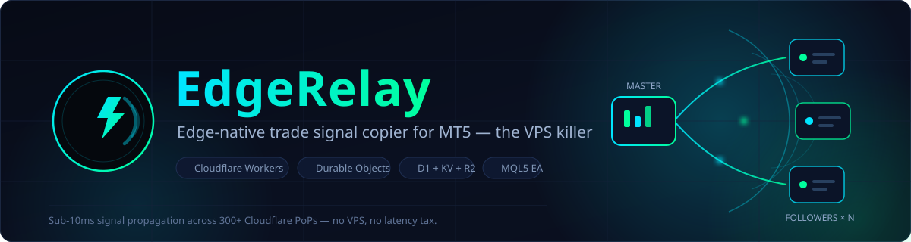
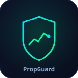
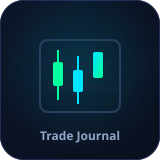
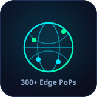
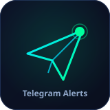
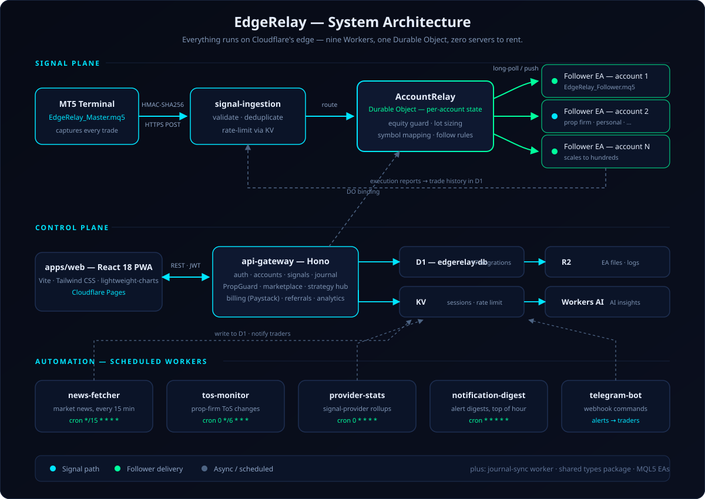

<p align="center">
  
</p>

<p align="center">
  <a href="https://edgerelay.com"></a>
  
  
  
  
  
</p>

<p align="center">
  <strong>Copy trades from one MT5 master account to unlimited followers in milliseconds —<br/>
  no VPS, no local copier software, no latency tax. The entire relay lives on Cloudflare's edge.</strong>
</p>

---

## Table of Contents

- [Overview](#overview)
- [Key Features](#key-features)
- [How It Works](#how-it-works)
- [Architecture](#architecture)
- [Tech Stack](#tech-stack)
- [Getting Started](#getting-started)
- [Project Structure](#project-structure)
- [Monorepo Commands](#monorepo-commands)
- [Roadmap](#roadmap)
- [Contributing](#contributing)
- [License](#license)

## Overview

**EdgeRelay** is an edge-native trade signal copier built entirely on Cloudflare's global network. Traditional trade copiers force you to rent a Windows VPS, keep MetaTrader running 24/7 next to your broker's server, and babysit fragile copier EAs. EdgeRelay deletes all of that: the Master EA signs each trade and POSTs it to the nearest Cloudflare PoP, a Durable Object evaluates per-follower rules, and follower EAs receive their instructions in milliseconds — from anywhere on Earth.

It is built for:

- **Prop-firm traders** managing 3–20 funded MT5 accounts across multiple brokers
- **Signal providers** broadcasting trades to hundreds of subscribers
- **Retail traders** copying across personal and prop accounts

Around the copier core, EdgeRelay has grown into a full trading-operations platform — the product suite behind [TradeMetricsPro](https://trademetricspro.com) — with a trade journal, prop-firm risk guard, strategy marketplace, academy, and a Telegram bot, all served from the same edge monorepo.

## Key Features

<p>
  
  
  
  
  
</p>

- **Millisecond signal relay** — Master EA detects a trade, signs it with HMAC-SHA256, and POSTs to the nearest Cloudflare PoP; followers receive approved signals over HTTP long-poll. No VPS anywhere in the loop.
- **Per-account Durable Object brain** — each account's relay state lives in an `AccountRelay` Durable Object that enforces follow rules before anything executes: equity guard, lot sizing, and symbol-suffix mapping across brokers.
- **PropGuard risk protection** — equity protection and daily-drawdown guardrails purpose-built for funded accounts, so one bad signal can't fail your challenge.
- **Full trade journal & analytics** — every execution report flows back into D1; the journal-sync pipeline and in-app analytics turn raw fills into per-account, per-strategy performance insight, with Workers AI-powered insights on top.
- **Prop-firm operations hub** — firm directory, challenge tracking, firm rule templates, and a `tos-monitor` Worker that watches prop-firm Terms-of-Service pages every 6 hours and alerts you when rules change.
- **Signal provider toolkit** — broadcast to unlimited subscribers, hourly provider-stat rollups, a public strategy hub, and a marketplace for monetising your track record.
- **Telegram-native** — a webhook-driven bot Worker for trade alerts and account commands, plus a Telegram Mini App, and hourly notification digests.
- **Market awareness** — `news-fetcher` pulls market news every 15 minutes; Market Pulse and news filters keep copier behaviour sane around high-impact events.

## How It Works

1. **Master EA** (`EdgeRelay_Master.mq5`) on any MT5 chart captures every open, modify, and close, signs it with HMAC-SHA256, and POSTs to the `signal-ingestion` Worker.
2. **signal-ingestion** validates the signature, deduplicates, rate-limits via KV, and routes the signal to the right **AccountRelay Durable Object**.
3. The **Durable Object** evaluates each follower's rules — equity guard, lot sizing, symbol mapping — and queues approved signals.
4. **Follower EAs** (`EdgeRelay_Follower.mq5`) long-poll for instructions, execute locally, and report the result back; fills land in D1 for journaling and analytics.

## Architecture

<p align="center">
  
</p>

Nine purpose-built Workers, one stateful Durable Object, and zero servers:

| Component | What it does |
|---|---|
| `signal-ingestion` | HMAC validation, dedupe, KV rate-limiting, routes signals to the relay DO |
| `account-relay` | `AccountRelay` Durable Object — per-account state and follower rule engine (binding-only, no public HTTP) |
| `api-gateway` | Hono REST API — auth, accounts, signals, journal, PropGuard, marketplace, strategy hub, analytics, referrals, Paystack billing |
| `journal-sync` | Syncs trade history from the `TradeJournal_Sync.mq5` EA into D1 |
| `news-fetcher` | Cron (`*/15 * * * *`) — market news ingestion |
| `tos-monitor` | Cron (`0 */6 * * *`) — prop-firm ToS change detection + Telegram alerts |
| `provider-stats` | Cron (`0 * * * *`) — hourly signal-provider statistics rollups |
| `notification-digest` | Cron — hourly notification digests |
| `telegram-bot` | Telegram webhook handler — alerts, commands, Mini App backend |

## Tech Stack

| Layer | Technology |
|---|---|
| Runtime | Cloudflare Workers (TypeScript) + Hono |
| State | Cloudflare Durable Objects (per-account relay state) |
| Database | Cloudflare D1 — 17 migrations in `migrations/` |
| Cache / sessions | Cloudflare KV |
| Object storage | Cloudflare R2 (EA files, trade logs) |
| AI | Cloudflare Workers AI (insights) |
| Frontend | React 18 · Vite 6 · TypeScript · Tailwind CSS 4 · Zustand · lightweight-charts — PWA on Cloudflare Pages |
| Terminal bridge | Custom MQL5 Expert Advisors for MetaTrader 5 |
| Payments | Paystack (subscriptions + EA credits) |
| Tooling | pnpm 9 workspaces · Turborepo · Wrangler 3 |

## Getting Started

**Prerequisites:** Node.js ≥ 20, pnpm 9.15, and the [Wrangler CLI](https://developers.cloudflare.com/workers/wrangler/) authenticated against your Cloudflare account.

```bash
# 1. Install dependencies
pnpm install

# 2. Provision Cloudflare resources (D1, KV namespaces, R2 bucket, Pages project)
bash scripts/setup.sh
#    → paste the generated IDs into each worker's wrangler.toml

# 3. Apply the D1 schema locally
pnpm db:migrate

# 4. Set secrets (per worker, via wrangler)
wrangler secret put PAYSTACK_SECRET_KEY
wrangler secret put GOOGLE_CLIENT_ID
wrangler secret put GOOGLE_CLIENT_SECRET

# 5. Run everything in dev mode (Turbo fans out to all packages)
pnpm dev
```

**Deploy:**

```bash
pnpm deploy        # turbo deploy — builds, then deploys all workers
```

**MT5 side:** install the EAs from `apps/ea/`, add the ingestion and API Worker URLs to *Tools → Options → Expert Advisors → Allow WebRequest*, and follow [`docs/ea-setup-guide.md`](docs/ea-setup-guide.md) for the full input reference.

## Project Structure

```
EdgeRelay/
├── apps/
│   ├── web/                     # React 18 PWA — dashboard, journal, PropGuard, marketplace, academy… (47 pages)
│   │   ├── public/              # PWA manifest, service worker, icons
│   │   └── src/                 # pages · components · stores · hooks
│   └── ea/                      # MQL5 Expert Advisors
│       ├── EdgeRelay_Master.mq5
│       ├── EdgeRelay_Follower.mq5
│       └── TradeJournal_Sync.mq5
├── workers/
│   ├── api-gateway/             # Hono REST API (auth, billing, accounts, signals, journal…)
│   ├── signal-ingestion/        # Signed trade-signal intake
│   ├── account-relay/           # AccountRelay Durable Object — the copier brain
│   ├── journal-sync/            # Trade-history sync from the journal EA
│   ├── news-fetcher/            # Market news cron
│   ├── tos-monitor/             # Prop-firm ToS change watcher
│   ├── provider-stats/          # Signal-provider stats rollup
│   ├── notification-digest/     # Hourly alert digests
│   └── telegram-bot/            # Telegram webhook bot + Mini App API
├── packages/
│   └── shared/                  # Shared types, constants, validation
├── migrations/                  # 17 D1 migrations (schema, indexes, plans, propguard, journal…)
├── scripts/                     # setup.sh · e2e-test.sh · e2e-cleanup.sh
├── docs/                        # PRD, EA setup guide, product blueprint
└── promo/                       # Launch assets, guides, OBS profiles
```

## Monorepo Commands

| Command | Description |
|---|---|
| `pnpm dev` | Run all apps and workers in dev mode (Turbo) |
| `pnpm build` | Build every package |
| `pnpm typecheck` | Type-check across the monorepo |
| `pnpm lint` | Lint across the monorepo |
| `pnpm deploy` | Build and deploy all workers |
| `pnpm db:migrate` | Apply D1 migrations locally (`wrangler d1 migrations apply edgerelay-db --local`) |

## Roadmap

- [x] Master / Follower EAs with HMAC-signed HTTPS signal flow
- [x] AccountRelay Durable Object with equity guard, lot sizing, symbol mapping
- [x] Dashboard, trade journal, PropGuard, prop-firm hub
- [x] Paystack billing, referrals, EA credits
- [x] Strategy hub, marketplace, provider stats, Telegram bot + Mini App
- [x] ToS monitor, market news, notification digests, AI insights
- [ ] WebSocket follower connections (replacing long-poll)
- [ ] cTrader / DXTrade support
- [ ] Native mobile app

## Contributing

EdgeRelay is a private, commercial monorepo. If you have access: branch from `main`, keep packages type-checked (`pnpm typecheck`) before pushing, and never commit `.dev.vars`, API keys, or EA secrets — provisioning goes through `scripts/setup.sh` and `wrangler secret put`.

## License

Proprietary — all rights reserved. No open-source license is currently granted for this codebase.

---

<p align="center">
  <sub>Built on the edge — <a href="https://edgerelay.com">edgerelay.com</a> · Cloudflare Workers + Durable Objects + MQL5</sub>
</p>
